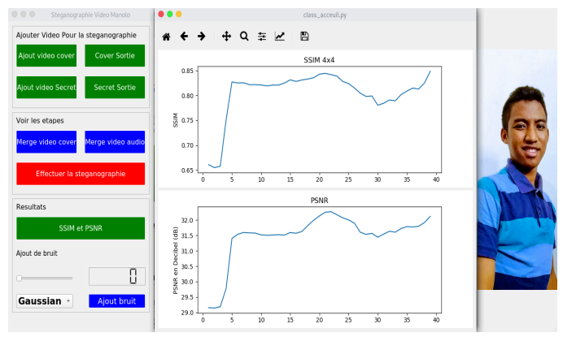

# DeepVideo_dissimulation

Tool that computes both Image and Audio :
For Video steganography

- Auto encoder for image steganography
- LSB for audio steganography

Everything are combine in one Tool :
- Graphic interface by PYQT5
- Chart result by Matplotlib
- Deep learning with Tensorflow 

Prerequisis are :
- PyQ5 to install you need to tap the following comand : pip install PyQt5
- Tensorflow with keras backend : pip install Tensorflow
- Open-cv Python : pip install Python-opencv

Here is the main window of the utility :

Manolo RAJAONAH - Devellopment
